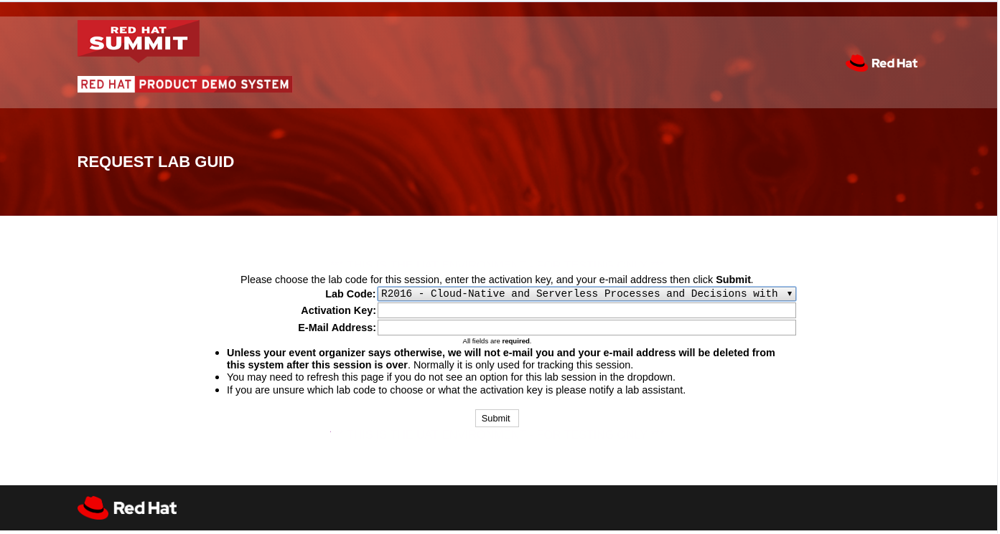
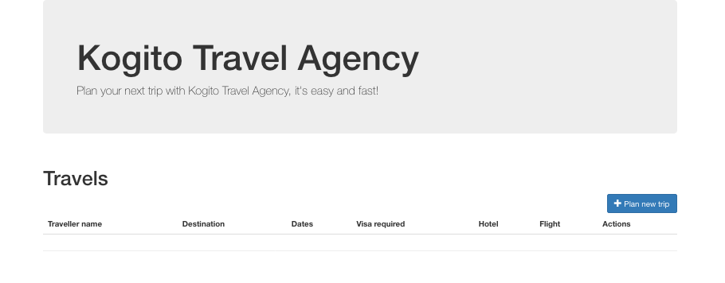
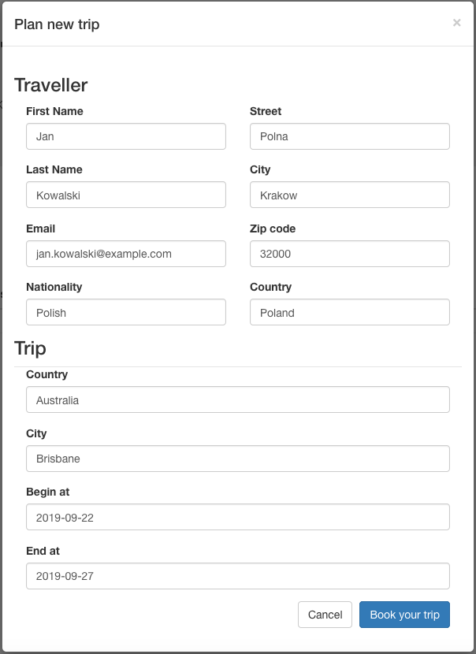
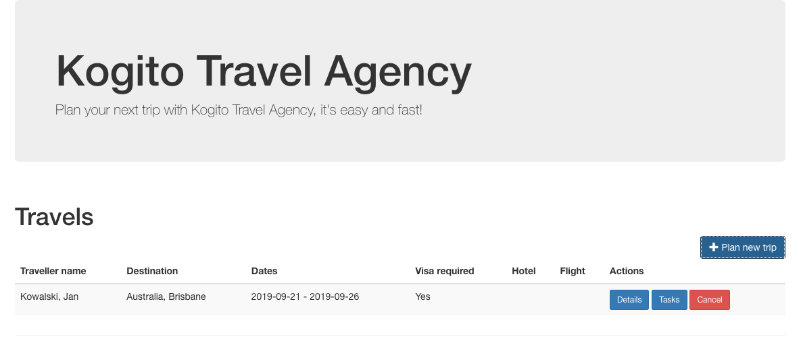
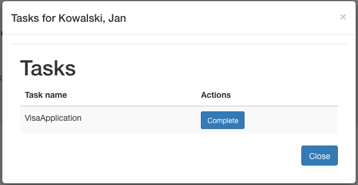
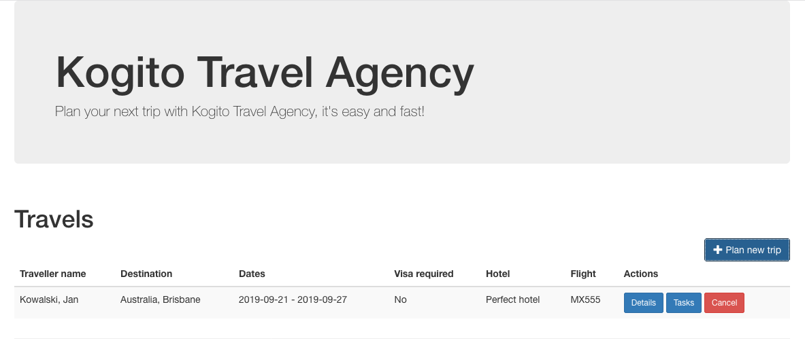
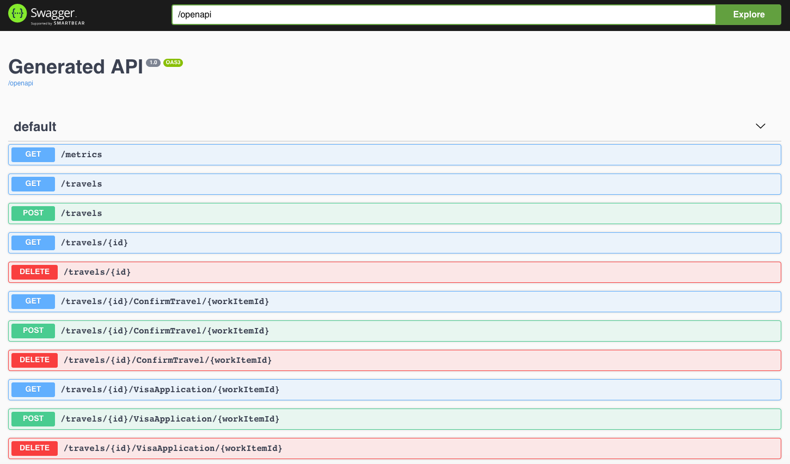

:noaudio:
:scrollbar:
:data-uri:
:toc2:
:linkattrs:

= RHTE 2019: Cloud-Native and Serverless Processes and Decisions with jBPM, Drools and Quarkus

:numbered:

== Lab environment and setup

.Prerequisites
.. The `ssh` utility installed on your laptop.
.. Web browser installed on your laptop.
.. Broadband internet connectivity.

A lab environment is provided to you. The environment consists of:

* An Openshift cluster.
* A virtual machine with developer tools (git, JDK, Maven, GraalVM) installed.

To obtain access to your lab environment:

. In a browser window, navigate to the RHTE _GuidGrabber_ at https://www.opentlc.com/gg/gg.cgi?profile=???
+

. Select the *Lab Code* : `S003 - Cloud-Native and Serverless Processes and Decisions with jBPM, Drools and Quarkus`
. Enter the *Activation Key* provided by your instructor.
. Enter your *E-Mail Address*.
. Click *Submit*
. The resulting page will display your lab's _GUID_ and other useful information about your lab environment.
+
image::images/guid_grabber_2.png[]
. Open a terminal window and log into the lab virtual machine:
+
----
$ export GUID=<your GUID obtained from the GuidGrabber>
$ ssh lab-user@workstation-$GUID.rhpds.opentlc.com
----
* When prompted, enter the password provided by the instructor.
. From the workstation, you can log into the OpenShift cluster using the `oc` utility:
+
----
$ oc login -u user1 https://master00.example.com -u user1
----
+
.Sample output
----
The server is using a certificate that does not match its hostname: x509: certificate is valid for kubernetes, kubernetes.default, kubernetes.default.sv
c, kubernetes.default.svc.cluster.local, master00.example.com, openshift, openshift.default, openshift.default.svc, openshift.default.svc.cluster.local,
 172.30.0.1, 192.168.0.10, not master00-b8ad.generic.opentlc.com
You can bypass the certificate check, but any data you send to the server could be intercepted by others.
Use insecure connections? (y/n): y

Username: user1
Password:
Login successful.
----
* Accept to use insecure connections.
* When prompted, enter the pasword provided by the instructor.
. To access the OpenShift cluster console from your laptop, open a browser window and navigate to the url https://master00-<GUID>.generic.opentlc.com - replace <GUID> with the lab GUID from the GuidGrabber tool.
* Your OpenShift cluster uses self-signed certificates, so expect a security warning in the browser. Create a security exception and proceed.
* Login with user `user1` and the password provided by the lab instructor.

== Use Case

During this workshop we will create and deploy a software system for a startup travel agency called Kogito Travel Agency.
The system will consist of a Kogito _Booking System Service_ implemented with a BPMN2 process definition and rules.

image:images/travels-process.png[]

The _Hotel Booking_ and _Flight Booking_ functionalities are implemented as _private_ subprocesses

image:images/book-hotel-process.png[]

image:images/book-flight-process.png[]

These processes call _Hotel Booking Service_ and _Flight Booking Service_, which are both implemented as CDI beans that have hard coded logic to return a booked flight or hotel.

org.acme.travels.service.HotelBookingService
org.acme.travels.service.FlightBookingService

Obviously this has been done for simplicity reasons. In a real application these functionalities would be implemented as microservices. However, the current implementation does show the power of Kogito processes definition integration with CDI.

== Cloning the repository
You are provided with a GitHub repository that contains 3 Kogito projects:

* 01-kogito-travel-agency: The base project which contains the _Booking System Service_. This project deploys as a single Quarkus application (JAR or Native Image) and does not support persistence.
* 02-kogito-travel-agency: The base project with persistence support. This project requires Infinispan / JBoss Data Grid.
* 03-kogito-travel-agency: Extension of project 3 with Kafka integration support to implement an Event Driven _Booking System Service_.

The GitHub repository can be found here: https://github.com/rhte2019-kogito/kogito-travel-agency-tutorial/

. Login to your workstation as explained in the previous paragraph.
. When logged in, clone the Kogito Lab repository:
+
----
$ git clone https://github.com/rhte2019-kogito/kogito-travel-agency-tutorial.git
----
+
. Navigate tot the _Kogito Travel Agency Tutorial_ folder.
+
----
$ cd kogito-travel-agency-tutorial
----
+
. This folder contains the 3 projects that we will use during this lab.
. Switch to the `rhte2019` branch of the repository.
+
----
$ git checkout rhte2019
----
+

== Lab 1: Kogito Development

https://kogito.kie.org/[_Kogito_] is the _Cloud-Native Business Automation platform for building Intelligent Applications_.
It's build on top of https://www.quarkus.io[Quarkus], a _Kubernetes Native Java stack tailored for GraalVM & OpenJDK HotSpot, crafted from the best of breed Java libraries and standards_.

One of the focusses of Quarkus, and thus of Kogito, is _Developer Experience_. Functionalities like _dev mode_ and _hot reload_ allows developers to make changes in their source code and configuration files, and immediately have these changes available in their test environment, without the need to explicitly compile and redeploy the application. This _hot reload_ functionality is only activated when the application is refreshed (for example when hitting the application with a RESTful request).

When you run `mvn compile quarkus:dev` {project-name}, the Kogito/Quarkus application will launch in development mode. When
it receives a HTTP request it will hold the request, and check to see if any application source
files (Java code, process definitions, rule definitions, etc.) have been changed. If they have it will transparently compile the changed files, redeploy
the application with the changed files, and then the HTTP request will continue to the redeployed
application. Project redeploys are much faster than a traditional app server, so for all but the largest
applications this should take well under a second. This greatly speeds up a developer's development cycle.

Kogito provides support for not only hot-reloading source code, but also business assets, like BPMN2 process definitions, DMN decision definitions, DRL rule files, Excel-based decision tables. This makes Kogito and its supported resources a first-class-citizen in the Quarkus eco-system.

In this part of the lab, we will experience the _hot-reload_ semantics of Kogito by altering the rules of our _Kogito Travel Agency_ application.

. From the `/home/lab-user/kogito-travel-agency-tutorial` folder, navigate to the `01-kogito-travel-agency` folder.
+
----
$ cd 01-kogito-travel-agency
----
+
. Run the Maven command to start the Kogito application in _dev-mode_.
+
----
mvn clean package quarkus:dev
----
+
. If everything executed correctly, you will now see the application running in _dev-mode_.
+
----
[INFO] --- quarkus-maven-plugin:0.20.0:dev (default-cli) @ kogito-travel-agency ---
Listening for transport dt_socket at address: 5005
2019-08-23 11:19:53,578 INFO  [io.qua.dep.QuarkusAugmentor] (main) Beginning quarkus augmentation
2019-08-23 11:20:00,485 INFO  [io.qua.dep.QuarkusAugmentor] (main) Quarkus augmentation completed in 6907ms
2019-08-23 11:20:00,878 INFO  [io.qua.swa.run.SwaggerUiServletExtension] (main) Swagger UI available at /swagger-ui
2019-08-23 11:20:01,515 INFO  [io.quarkus] (main) Quarkus 0.20.0 started in 8.297s. Listening on: http://[::]:8080
2019-08-23 11:20:01,542 INFO  [io.quarkus] (main) Installed features: [cdi, kogito, resteasy, resteasy-jsonb, smallrye-openapi, swagger-ui]
----
+

We can see that the applications has a number of features installed, including _kogito_ to provide intelligent business application support, _resteasy_ to provide RESTful support, and _swagger-ui_ to provide swagger support.

Let's first access the application via the provided user interface.

. On your laptop, open a browser (Chrome, Firefox) and navigate to your workstation at: http://workstation-$GUID.rhpds.opentlc.com:8080 (replace $GUID with the GUID provided to you)
. You will see the following application UI.

First we want to explore the semantic of our service. As we can see in the process diagram, the first node that is executed is _Business Rules_ node.

image:images/travels-process.png[]

This node executes the rules that determine whether an booking requires a visa or not. The rules can be found in the `visa-rules.drl` file located in the package `org.acme.travels` in the `src/main/resources` folder of the project.
Let's take a quick look at the rules:

----
rule "Polish citizens require visa to US"
	ruleflow-group "visas"
	when
		$trip: Trip($trip.country == "US")
		$traveller : Traveller($traveller.nationality == "Polish")
	then
		$trip.setVisaRequired( true );
end

rule "Polish citizens do not require visa to UK"
	ruleflow-group "visas"
	when
		$trip: Trip($trip.country == "UK")
		$traveller : Traveller($traveller.nationality == "Polish")
	then
		$trip.setVisaRequired( false );
end

rule "Polish citizens require visa to Australia"
	ruleflow-group "visas"
	when
		$trip: Trip($trip.country == "Australia")
		$traveller : Traveller($traveller.nationality == "Polish")
	then
		$trip.setVisaRequired( true );
end
----

What we can see is that, depending on the destination country, a `Traveller` from Poland either requires a visa or not. In this lab we will change one of these rules to demonstrate the _hot-reload_ functionality.

. Open the UI of the application and click on the blue _"+ Plan new trip"_ button.
. In the form, enter the following values and click on the blue _"Book your trip"_ button:
* Traveller:
** First Name: "Jan"
** Last Name: "Kowalski"
** Email: "jan.kowalski@example.com"
** Nationality: "Polish"
** Street: "Polna"
** City: "Krakow"
** Zip code: "32000"
** Country: "Poland"
* Trip:
** Country: "Australia"
** City: "Brisbane"
** Begin at: "2019-09-22"
** End at: "2019-09-27"
+

+
. A new entry should appear in the list of travels. The entry shows that a visa is required, indicating that the business rules have determined that a traveller from Poland travelling to Australia requires a visa.

. Click on the _"Tasks"_ button. A task named _"Visa Application"_ should appear.

 Let's now change this rule in such a way that a traveller from Poland does *not* require a visa when travelling to Australia. We will change the rule in our _DRL_ file and demonstrate the _hot-reload_ feature of Kogito.

 . Open a new SSH session to your workstation. This allows us to change one of our source files, while we keep our application running in _dev-mode_ in our other terminal.
 +
 ----
 $ export GUID=<your GUID obtained from the GuidGrabber>
 $ ssh lab-user@workstation-$GUID.rhpds.opentlc.com
 ----
 * When prompted, enter the password provided by the instructor.
 . Navigate to the project folder:
 +
 ----
 $ cd kogito-travel-agency-tutorial/01-kogito-travel-agency
 ----
. Open the `visa-rules.drl` file using VIM
+
----
vim src/main/resources/org/acme/travels/visa-rules.drl
----
+
. Navigate to the rule with the name _"Polish citizens require visa to Australia"_ and change the `then` (the rule consequence) in such a way that no visa is required:
+
[subs="quotes"]
----
rule "Polish citizens require visa to Australia"
  ruleflow-group "visas"
when
  $trip: Trip($trip.country == "Australia")
  $traveller : Traveller($traveller.nationality == "Polish")
then
  *$trip.setVisaRequired( false );*
end
----
+
. Save and exit by pressing `:wq` and `Enter`.
. In the application UI, create a new booking with the exact same data as the previous one. Observe that no visa is required.

. Go to the SSH terminal in which the application is running. The log will show that a change in the _DRL_ file was detected and Quarkus/Kogito reloaded the application:
+
----
2019-08-23 13:40:57,170 INFO  [io.qua.dev] (executor-thread-1) Changed source files detected, recompiling [/home/lab-user/kogito-travel-agency-tutorial/01-kogito-travel-agency/src/main/resources/org/acme/travels/visa-rules.drl]
2019-08-23 13:40:58,328 INFO  [io.quarkus] (executor-thread-1) Quarkus stopped in 0.001s
2019-08-23 13:40:58,336 INFO  [io.qua.dep.QuarkusAugmentor] (executor-thread-1) Beginning quarkus augmentation
2019-08-23 13:40:58,678 INFO  [io.qua.dep.QuarkusAugmentor] (executor-thread-1) Quarkus augmentation completed in 342ms
2019-08-23 13:40:58,725 INFO  [io.qua.swa.run.SwaggerUiServletExtension] (executor-thread-1) Swagger UI available at /swagger-ui
2019-08-23 13:40:58,779 INFO  [io.quarkus] (executor-thread-1) Quarkus 0.20.0 started in 0.451s. Listening on: http://[::]:8080
2019-08-23 13:40:58,780 INFO  [io.quarkus] (executor-thread-1) Installed features: [cdi, kogito, resteasy, resteasy-jsonb, smallrye-openapi, swagger-ui]
2019-08-23 13:40:58,780 INFO  [io.qua.dev] (executor-thread-1) Hot replace total time: 1.612s
----

We've seen the _hot-reload semantics of Kogito in action. Next we will look at how Kogito applications expose their RESTful API and how they adapt to your domain data.

== Lab 2: Domain Driven Business Applications

In previous versions of our Business Application platforms, the RESTful services always exposed generic RESTful APIs. An example of this was the commands-based API to invoke Drools Rules via KIE-Server, and the Map-based input parameters when starting a jBPM businesss process.

In Kogito, the exposed (RESTful) services are generated based on your domain data. In other words, Kogito adopts to your business domain rather than the other way around. This prevents the leaking of abstractions of the platform into your client applications and services and allows you to stay focused on the business and business domain instead of being concerned with the technology behind it.

Kogito accomplishes this by introspecting the business assets (process definitions, DRL, DMN, etc), and generating its remoting APIs based on the data-types and functionalities of your assets. This allows Kogito to expose domain specific APIs to its consumers.

A good way to demonstrate this is to inspect the Swagger documentation of our _Kogito Travel Agency_ application.

. With the _Kogito Travel Agency_ application still running, navigate to http://workstation-$GUID.rhpds.opentlc.com:8080/swagger-ui (replace $GUID with the GUID provided to you).
. Inspect the Swagger documentation. Note that the API defines RESTful resources like `Travel` and `VisaApplication` instead of `Process` and `Tasks`.

*TODO*: Have people start a Travel via the Swagger UI.

== Lab 3: Kogito Persistence

TODO: Elaborate on persistence mechanism.

In this section of the lab we will use the `02-kogito-travel-agency` project, which is the same project as used in the previous lab, but this time with persistence enabled. We use _Infinispan_ as persistent data store for process data. +
In the lab we will deploy the application to OpenShift. We will also build and deploy a native image to OpenShift.

=== Local test of the application

. From the `/home/lab-user/kogito-travel-agency-tutorial` folder, navigate to the `02-kogito-travel-agency` folder.
+
----
$ cd 02-kogito-travel-agency
----
. Inspect the POM file of the project. Take note of the dependencies to `io.quarkus:quarkus-infinispan-client` and `org.kie.kogito:infinispan-persistence-addon`. This is all it takes to enable persistence using Infinispan.
. Inspect the contents of `src/main/resources/application.properties`.
+
----
quarkus.infinispan-client.server-list=localhost:11222
----
+
The `quarkus.infinispan-client.server-list` entry defines the list of Infinispan servers for the Quarkus Infinispan client to connect to upon startup. The Quarkus Infinispan client uses the _Infinispan Hot Rod_ protocol to connect to a remote Infinispan server.
. Start a local instance of Infinispan on the lab workstation using Podman. +
Open a new terminal, ssh into the workstation as user `lab-user`, and run the following commands:
+
----
$ sudo podman run -it -p 11222:11222 jboss/infinispan-server:10.0.0.Beta3
----
+
Let the Infinispan server start up. After a couple of seconds you will see the following output:
+
----
05:25:15,708 INFO  [org.jboss.as] (Controller Boot Thread) WFLYSRV0025: Infinispan Server 10.0.0.Beta3 (WildFly Core 6.0.2.Final) started in 5484ms - Started 227 of 275 services (133 services are lazy, passive or on-demand)
----
. Run the Kogito Travel Agency app in _dev mode_:
+
----
$ mvn clean compile quarkus:dev
----
+
.Output
----
2019-08-25 07:35:10,384 INFO  [io.qua.swa.run.SwaggerUiServletExtension] (main) Swagger UI available at /swagger-ui
2019-08-25 07:35:10,937 INFO  [org.inf.cli.hot.imp.pro.Codec] (HotRod-client-async-pool-1-1) ISPN004006: Server sent new topology view (id=1, age=0) containing 1 addresses: [172.17.42.3:11222]
2019-08-25 07:35:10,940 INFO  [org.inf.cli.hot.imp.tra.net.ChannelFactory] (HotRod-client-async-pool-1-1) ISPN004014: New server added(172.17.42.3:11222), adding to the pool.
2019-08-25 07:35:10,943 INFO  [org.inf.cli.hot.imp.tra.net.ChannelFactory] (HotRod-client-async-pool-1-1) ISPN004016: Server not in cluster anymore(localhost:11222), removing from the pool.
2019-08-25 07:35:11,022 INFO  [org.inf.cli.hot.RemoteCacheManager] (main) ISPN004021: Infinispan version: 10.0.0.Beta5
2019-08-25 07:35:11,045 INFO  [org.inf.cli.hot.imp.pro.Codec] (HotRod-client-async-pool-1-2) ISPN004006: Server sent new topology view (id=1, age=0) containing 1 addresses: [172.17.42.3:11222]
2019-08-25 07:35:11,225 INFO  [io.quarkus] (main) Quarkus 999-SNAPSHOT started in 5.081s. Listening on: http://0.0.0.0:8080
2019-08-25 07:35:11,225 INFO  [io.quarkus] (main) Installed features: [cdi, infinispan-client, kogito, resteasy, resteasy-jsonb, smallrye-health, smallrye-openapi, swagger-ui, vertx, vertx-web]
----
+
Note that the application successfully discovered the Infinispan server.
. Check the logs of the Infinispan server. Note the following output:
+
----
05:35:11,172 INFO  [org.jboss.as.clustering.infinispan] (async-thread--p6-t1) DGISPN0001: Started travels_store ca
che from clustered container
05:35:11,203 INFO  [org.jboss.as.clustering.infinispan] (async-thread--p6-t2) DGISPN0001: Started flightBooking_st
ore cache from clustered container
05:35:11,219 INFO  [org.jboss.as.clustering.infinispan] (async-thread--p6-t3) DGISPN0001: Started hotelBooking_sto
re cache from clustered container
----
. Create a couple of travel requests using the application UI or the Swagger UI.
. Press `Ctrl-C` to shut down the application. Keep the Infinispan server running. Start the application again in _dev mode_. Notice that the travel requests are still present.
. At this point feel free to shut down both the application as the Infinispan server.

=== Deployment to OpenShift - JVM mode

. From the lab workstation, login into the OpenShift cluster using the `oc` utility as user1:
+
----
$ oc login -u user1 https://master00.example.com -u user1
----
. Create a project for the Kogito Travel Agency application
+
----
$ oc new-project kogito
----
. The `openshift` folder of the `02-kogito-travel-agency` project contains a OpenShift template file for an Infinispan deployment. It will create a minimal Infinispan deployment, consisting of 1 node, with disabled security,and  exposing a Hot Rod endpoint on port 11222. To deploy Infinispan on your OpenShift cluster:
+
----
$ oc process -f openshift/infinispan-server.yml | oc create -f - -n kogito
----
. Follow the deployment of the Infinispan server on the OpenShift console, or use `oc`:
+
----
$ oc get pods -w
----
+
.Output
----
NAME                                 READY     STATUS              RESTARTS   AGE
infinispan-server-656b846c7c-rgz8z   0/1       ContainerCreating   0          6s
infinispan-server-656b846c7c-rgz8z   0/1       Running   0         35s
infinispan-server-656b846c7c-rgz8z   1/1       Running   0         1m
----

. By default, the Kogito Travel Agency app will try to connect to a Infinispan server on `localhost:11222`. When deploying on OpenShift, we need to configure the application to connect a remote Infinispan instance. To override the default configuration properties we can use a ConfigMap containing an `application.properties` file which will be mounted inside the application pod.
.. On the lab workstation, create a file `/tmp/application.properties`.
+
----
$ touch /tmp/application.properties
----
+
Using `vim`, add the following content to the file:
+
----
quarkus.infinispan-client.server-list=infinispan-server.kogito.svc:11222
----

.. Create a ConfigMap from the `application.properties` file:
+
----
$ oc create configmap kogito-travel-agency --from-file=/tmp/application.properties -n kogito
----

. The `openshift` folder of the `02-kogito-travel-agency` project contains a OpenShift template file for a binary deployment of the Kogito Travel Agency app. It describes a BuildConfig, ImageStream, DeploymentConfig, Service and Route for the application. In this lab, we will deploy the application itself usng a binary build from the lab workstation. +
Review the `kogito-travel-agency.yml` template file.
+
* We use the `redhat-openjdk18-openshift` image as a builder image. In JVM mode the application requires a JVM to run.
* The `kogito-travel-agency` configmap is mounted in the `/deployments/config` directory of the pod.

. Deploy the template to the OpenShift cluster:
+
----
$ oc process -f openshift/kogito-travel-agency.yml | oc create -f - -n kogito
----
+
.Output
----
service/kogito-travel-agency created
route.route.openshift.io/kogito-travel-agency created
deploymentconfig.apps.openshift.io/kogito-travel-agency created
buildconfig.build.openshift.io/kogito-travel-agency created
imagestream.image.openshift.io/kogito-travel-agency created
----

. On the lab workstation, build the Kogito Travel Agency app:
+
----
$ mvn clean package -DskipTests=true
----
+
The project unit tests require a running local Infinispan instance, so we can skip them.

. Inspect the `target` folder of the project:
+
----
$ ls target
----
+
----
drwxrwxr-x. 5 lab-user lab-user   4096 Aug 25 08:41 classes
drwxrwxr-x. 4 lab-user lab-user   4096 Aug 25 08:41 generated-sources
drwxrwxr-x. 3 lab-user lab-user   4096 Aug 25 08:41 generated-test-sources
-rw-rw-r--. 1 lab-user lab-user     60 Aug 25 08:41 image_metadata.json
-rw-rw-r--. 1 lab-user lab-user  21688 Aug 25 08:41 kogito-travel-agency-1.0-SNAPSHOT.jar
-rw-r--r--. 1 lab-user lab-user 371650 Aug 25 08:41 kogito-travel-agency-1.0-SNAPSHOT-runner.jar
drwxrwxr-x. 2 lab-user lab-user  20480 Aug 25 08:41 lib
drwxrwxr-x. 2 lab-user lab-user   4096 Aug 25 08:41 maven-archiver
drwxrwxr-x. 3 lab-user lab-user   4096 Aug 25 08:41 maven-status
drwxrwxr-x. 3 lab-user lab-user   4096 Aug 25 08:41 test-classes
drwxrwxr-x. 2 lab-user lab-user   4096 Aug 25 08:41 transformed-classes
drwxrwxr-x. 6 lab-user lab-user   4096 Aug 25 08:41 wiring-classes
----
+
`kogito-travel-agency-1.0-SNAPSHOT-runner.jar` is a executable JAR file. It is however not an _uber-jar_ as the dependencies are copied into the target/lib directory.

. Prepare for a binary build on OpenShift.
On your workstation, create a directory `/tmp/kogito-travel-agency`. Copy the executable application jar and the lib folder to the directory.
+
----
$ mkdir /tmp/kogito-travel-agency
$ cp -r target/kogito-travel-agency-1.0-SNAPSHOT-runner.jar target/lib /tmp/kogito-travel-agency
----

. Deploy the application to OpenShift:
+
----
$ oc start-build kogito-travel-agency --from-dir=/tmp/kogito-travel-agency -n kogito
----
+
----
Uploading directory "/tmp/kogito-travel-agency" as binary input for the build ...
...........
Uploading finished
build.build.openshift.io/kogito-travel-agency-1 started
----
. Check the logs of the builder pod:
+
----
$ oc logs kogito-travel-agency-1-build -n kogito
----
+
----
Using docker-registry.default.svc:5000/openshift/redhat-openjdk18-openshift@sha256:dc84fed0f6f40975a2277c126438c8aa15c70eeac75981dbaa4b6b853eff61a6 as the s2i builder image
==================================================================
Starting S2I Java Build .....
S2I source build with plain binaries detected
Copying binaries from /tmp/src to /deployments ...
... done

Pushing image docker-registry.default.svc:5000/kogito-travel-agency/kogito-travel-agency:latest ...
Pushed 1/6 layers, 18% complete
Pushed 2/6 layers, 39% complete
Pushed 3/6 layers, 64% complete
Pushed 4/6 layers, 84% complete
Pushed 5/6 layers, 94% complete
Pushed 6/6 layers, 100% complete
Push successful
----
. Check the logs of the application pod:
+
----
Starting the Java application using /opt/run-java/run-java.sh ...
exec java -javaagent:/opt/jolokia/jolokia.jar=config=/opt/jolokia/etc/jolokia.properties -Xms63m -Xmx250m -XX:+UnlockExperimentalVMOptions -XX:+UseCGroupMemoryLimitForHeap -XX:+UseParallelOldGC -XX:MinHeapFreeRatio=10 -XX:MaxHeapFreeRatio=20 -XX:GCTimeRatio=4 -XX:AdaptiveSizePolicyWeight=90 -XX:MaxMetaspaceSize=100m -XX:ParallelGCThreads=1 -Djava.util.concurrent.ForkJoinPool.common.parallelism=1 -XX:CICompilerCount=2 -XX:+ExitOnOutOfMemoryError -cp . -jar /deployments/kogito-travel-agency-1.0-SNAPSHOT-runner.jar
I> No access restrictor found, access to any MBean is allowed
Jolokia: Agent started with URL https://10.128.0.180:8778/jolokia/
2019-08-25 06:57:22,237 INFO  [org.inf.cli.hot.imp.pro.Codec] (HotRod-client-async-pool-1-1) ISPN004006: Server sent new topology view (id=1, age=0) containing 1 addresses: [10.128.0.176:11222]
2019-08-25 06:57:22,246 INFO  [org.inf.cli.hot.imp.tra.net.ChannelFactory] (HotRod-client-async-pool-1-1) ISPN004014: New server added(10.128.0.176:11222), adding to the pool.
2019-08-25 06:57:22,248 INFO  [org.inf.cli.hot.imp.tra.net.ChannelFactory] (HotRod-client-async-pool-1-1) ISPN004016: Server not in cluster anymore(infinispan-server.kogito-travel-agency.svc:11222), removing from the pool.
2019-08-25 06:57:22,266 INFO  [org.inf.cli.hot.RemoteCacheManager] (main) ISPN004021: Infinispan version: 10.0.0.Beta5
2019-08-25 06:57:22,937 INFO  [org.inf.cli.hot.imp.pro.Codec] (HotRod-client-async-pool-1-1) ISPN004006: Server sent new topology view (id=1, age=0) containing 1 addresses: [10.128.0.176:11222]
2019-08-25 06:57:24,361 INFO  [io.quarkus] (main) Quarkus 999-SNAPSHOT started in 16.820s. Listening on: http://0.0.0.0:8080
2019-08-25 06:57:24,362 INFO  [io.quarkus] (main) Installed features: [cdi, infinispan-client, kogito, resteasy, resteasy-jsonb, smallrye-health, smallrye-openapi, vertx, vertx-web]
----
+
Notice that the application starts up in about 15 seconds. The pod takes more or less 300MB of memory.

. Test the Kogito Travel Agency application using the application UI or the Swagger UI.

=== Deployment to OpenShift - Native image

. Build a Linux 64-bit native executable of the Kogito Travel Agency application:
+
----
$ mvn clean package -DskipTests=true -Pnative
----
+
* This produces a native executable `kogito-travel-agency-1.0-SNAPSHOT-runner` in the `target` folder of the project. Note that this executable only runs on 64-bit Linux.
Native compilation may take 5-10 minutes to complete.
* Sample output:
+
----
[INFO] Scanning for projects...
[INFO]
[INFO] ---------------< org.acme.travels:kogito-travel-agency >----------------
[INFO] Building kogito-travel-agency 1.0-SNAPSHOT
[INFO] --------------------------------[ jar ]---------------------------------
[INFO]
[INFO] --- maven-clean-plugin:2.5:clean (default-clean) @ kogito-travel-agency ---
[INFO] Deleting /home/bernard/projects_internal/rhte2019-kogito/kogito-travel-agency-2/target
[INFO]
[INFO] --- maven-resources-plugin:2.6:resources (default-resources) @ kogito-travel-agency ---
[INFO] Using 'UTF-8' encoding to copy filtered resources.
[INFO] Copying 6 resources
[INFO]
[INFO] --- maven-compiler-plugin:3.1:compile (default-compile) @ kogito-travel-agency ---
[INFO] Changes detected - recompiling the module!
[INFO] Compiling 10 source files to /home/bernard/projects_internal/rhte2019-kogito/kogito-travel-agency-2/target/classes
[INFO]
[INFO] --- maven-resources-plugin:2.6:testResources (default-testResources) @ kogito-travel-agency ---
[INFO] Using 'UTF-8' encoding to copy filtered resources.
[INFO] skip non existing resourceDirectory /home/bernard/projects_internal/rhte2019-kogito/kogito-travel-agency-2/src/test/resources
[INFO]
[INFO] --- maven-compiler-plugin:3.1:testCompile (default-testCompile) @ kogito-travel-agency ---
[INFO] Changes detected - recompiling the module!
[INFO] Compiling 4 source files to /home/bernard/projects_internal/rhte2019-kogito/kogito-travel-agency-2/target/test-classes
[INFO]
[INFO] --- maven-surefire-plugin:2.22.0:test (default-test) @ kogito-travel-agency ---
[INFO] Tests are skipped.
[INFO]
[INFO] --- maven-jar-plugin:2.4:jar (default-jar) @ kogito-travel-agency ---
[INFO] Building jar: /home/bernard/projects_internal/rhte2019-kogito/kogito-travel-agency-2/target/kogito-travel-agency-1.0-SNAPSHOT.jar
[INFO]
[INFO] --- quarkus-maven-plugin:999-SNAPSHOT:build (default) @ kogito-travel-agency ---
[INFO] [io.quarkus.deployment.QuarkusAugmentor] Beginning quarkus augmentation
[INFO] [org.jboss.threads] JBoss Threads version 3.0.0.Beta5
[INFO] [io.quarkus.deployment.QuarkusAugmentor] Quarkus augmentation completed in 4915ms
[INFO] [io.quarkus.creator.phase.runnerjar.RunnerJarPhase] Building jar: /home/bernard/projects_internal/rhte2019-kogito/kogito-travel-agency-2/target/kogito-travel-agency-1.0-SNAPSHOT-runner.jar
[INFO]
[INFO] --- quarkus-maven-plugin:999-SNAPSHOT:native-image (default) @ kogito-travel-agency ---
[INFO] [io.quarkus.creator.phase.nativeimage.NativeImagePhase] Running Quarkus native-image plugin on OpenJDK 64-Bit Server VM
[INFO] [io.quarkus.creator.phase.nativeimage.NativeImagePhase] /home/bernard/apps/graalvm/current/bin/native-image -J-Djava.util.logging.manager=org.jboss.logmanager.LogManager -J-Dio.netty.leakDetection.level=DISABLED -J-Dvertx.disableDnsResolver=true -J-Dio.netty.noUnsafe=true --
initialize-at-build-time= -H:InitialCollectionPolicy=com.oracle.svm.core.genscavenge.CollectionPolicy$BySpaceAndTime -jar kogito-travel-agency-1.0-SNAPSHOT-runner.jar -J-Djava.util.concurrent.ForkJoinPool.common.parallelism=1 -H:FallbackThreshold=0 -H:+ReportExceptionStackTraces -H
:+PrintAnalysisCallTree -H:-AddAllCharsets -H:EnableURLProtocols=http,https --enable-all-security-services -H:NativeLinkerOption=-no-pie -H:-SpawnIsolates -H:+JNI --no-server -H:-UseServiceLoaderFeature -H:+StackTrace
[kogito-travel-agency-1.0-SNAPSHOT-runner:18704]    classlist:  20,599.62 ms
[kogito-travel-agency-1.0-SNAPSHOT-runner:18704]        (cap):   1,282.78 ms
[kogito-travel-agency-1.0-SNAPSHOT-runner:18704]        setup:   2,839.74 ms
12:07:05,137 INFO  [org.jbo.threads] JBoss Threads version 3.0.0.Beta5
[...]
[kogito-travel-agency-1.0-SNAPSHOT-runner:18704]   (typeflow):  33,347.24 ms
[kogito-travel-agency-1.0-SNAPSHOT-runner:18704]    (objects):  17,013.88 ms
[kogito-travel-agency-1.0-SNAPSHOT-runner:18704]   (features):     958.93 ms
[kogito-travel-agency-1.0-SNAPSHOT-runner:18704]     analysis:  55,337.70 ms
Printing call tree to /home/bernard/projects_internal/rhte2019-kogito/kogito-travel-agency-2/target/reports/call_tree_kogito-travel-agency-1.0-SNAPSHOT-runner_20190825_120813.txt
Printing list of used classes to /home/bernard/projects_internal/rhte2019-kogito/kogito-travel-agency-2/target/reports/used_classes_kogito-travel-agency-1.0-SNAPSHOT-runner_20190825_120819.txt
Printing list of used packages to /home/bernard/projects_internal/rhte2019-kogito/kogito-travel-agency-2/target/reports/used_packages_kogito-travel-agency-1.0-SNAPSHOT-runner_20190825_120819.txt
[kogito-travel-agency-1.0-SNAPSHOT-runner:18704]     (clinit):   1,180.92 ms
[kogito-travel-agency-1.0-SNAPSHOT-runner:18704]     universe:   3,353.74 ms
[kogito-travel-agency-1.0-SNAPSHOT-runner:18704]      (parse):   4,563.41 ms
[kogito-travel-agency-1.0-SNAPSHOT-runner:18704]     (inline):   6,275.42 ms
[kogito-travel-agency-1.0-SNAPSHOT-runner:18704]    (compile):  54,221.94 ms
[kogito-travel-agency-1.0-SNAPSHOT-runner:18704]      compile:  68,186.55 ms
[kogito-travel-agency-1.0-SNAPSHOT-runner:18704]        image:   6,117.41 ms
[kogito-travel-agency-1.0-SNAPSHOT-runner:18704]        write:   1,038.32 ms
[kogito-travel-agency-1.0-SNAPSHOT-runner:18704][total]: 179,075.43 ms
[INFO] ------------------------------------------------------------------------
[INFO] BUILD SUCCESS
[INFO] ------------------------------------------------------------------------
[INFO] Total time: 03:09 min
[INFO] Finished at: 2019-08-25T12:09:39+02:00
[INFO] ------------------------------------------------------------------------
----
. Optional: run and test the application locally. Make sure to start the Infinispan docker image first.
+
----
$ ./target/kogito-travel-agency-1.0-SNAPSHOT-runner
----
+
.Output
----
2019-08-25 12:33:21,676 INFO  [org.inf.cli.hot.imp.pro.Codec] (HotRod-client-async-pool-1-1) ISPN004006: Server sent new topology view (id=1, age=0) containing 1 addresses: [172.17.42.3:11222]
2019-08-25 12:33:21,676 INFO  [org.inf.cli.hot.imp.tra.net.ChannelFactory] (HotRod-client-async-pool-1-1) ISPN004014: New server added(172.17.42.3:11222), adding to the pool.
2019-08-25 12:33:21,676 INFO  [org.inf.cli.hot.imp.tra.net.ChannelFactory] (HotRod-client-async-pool-1-1) ISPN004016: Server not in cluster anymore(localhost:11222), removing from the pool.
2019-08-25 12:33:21,677 INFO  [org.inf.cli.hot.RemoteCacheManager] (main) ISPN004021: Infinispan version: null
2019-08-25 12:33:21,711 INFO  [org.inf.cli.hot.imp.pro.Codec] (HotRod-client-async-pool-1-3) ISPN004006: Server sent new topology view (id=1, age=0) containing 1 addresses: [172.17.42.3:11222]
2019-08-25 12:33:21,886 INFO  [io.quarkus] (main) Quarkus 999-SNAPSHOT started in 0.307s. Listening on: http://0.0.0.0:8080
2019-08-25 12:33:21,887 INFO  [io.quarkus] (main) Installed features: [cdi, infinispan-client, kogito, resteasy, resteasy-jsonb, smallrye-health, smallrye-openapi, swagger-ui, vertx, vertx-web]
----

. Build a Docker image with the native executable. The `src/main/docker` folder contains a Docker file based on a minimal RHEL8 UBI image. Build the Docker image using Podman:
+
----
$ sudo podman build -f src/main/docker/Dockerfile.native -t kogito-travel-agency:0.0.1 .
----
+
.Sample output
----
STEP 1: FROM registry.access.redhat.com/ubi8/ubi-minimal
Getting image source signatures
Copying blob e9152ec084c2 done
Copying blob 9b3f8c4ce518 done
Copying config 9c9faa7498 done
Writing manifest to image destination
Storing signatures
STEP 2: WORKDIR /work/
59898364eb11211127a646b625d9ec0edbb6afbbc20bc72ab543bb2f3d2ae92c
STEP 3: COPY target/*-runner /work/application
f081443003d57c8114d5f47fd1f82f118c4322bc640ea28bd1932cea731224b0
STEP 4: RUN chmod 775 /work
4c0ab746913f8021870046abe02c0e9951b60e625145968d8695ec1bb834dfa6
STEP 5: EXPOSE 8080
458dae96b2e69fd556342d37a50259552a2727ea2a9203928afc330f254ebd14
STEP 6: CMD ["./application", "-Dquarkus.http.host=0.0.0.0"]
STEP 7: COMMIT kogito-travel-agency:0.0.1
57c04fae486399869aeadba8fe7ac5dc1cd402c5d56cca290f025b86833a02b1
----

. Push the native image to the internal Docker registry of the OpenShift cluster.
.. Log in into the cluster as user `admin`. Use the same password as `user1`.
+
----
$ oc login -u admin
----
.. Create a public route to the docker registry in the `default` namespace.
+
----
$ oc create route passthrough docker-registry-lab --service=docker-registry -n default
----
.. Set the route to the docker registry as an environment variable.
+
----
$ export DOCKER_REGISTRY_HOSTNAME=$(oc get route docker-registry-lab -n default -o template --template='{{.spec.host}}')
----
.. Login to the internal registry of your OpenShift cluster.
+
----
$ export TKN=`oc whoami -t`
$ sudo podman login -u admin -p $TKN --tls-verify=false $DOCKER_REGISTRY_HOSTNAME
----
.. Tag the image
+
----
$ sudo podman tag kogito-travel-agency:0.0.1  $DOCKER_REGISTRY_HOSTNAME/openshift/kogito-travel-agency:0.0.1
----
.. Log back in as `user1`.
+
----
$ oc login -u user1
----

. Scale down the non-native version of the Kogito Travel Agency application:
+
----
$ oc scale dc kogito-travel-agency --replicas=0 -n kogito
----

. The `openshift` folder of the `02-kogito-travel-agency` project contains a OpenShift template file for a deployment of the native version of the Kogito Travel Agency app. It describes a DeploymentConfig, Service and Route for the application. +
Review the `kogito-travel-agency-native.yml` template file.
+
* The DeploymentConfig points to the imagestream of the image we pushed to the OpenShift registry.
* The `kogito-travel-agency` configmap is mounted in the `/work/config` directory of the pod.

. Deploy the template to the OpenShift cluster:
+
----
$ oc process -f openshift/kogito-travel-agency-native.yml | oc create -f - -n kogito
----
+
.Output
----
service/kogito-travel-agency-native created
route.route.openshift.io/kogito-travel-agency-native created
deploymentconfig.apps.openshift.io/kogito-travel-agency-native created
----

----
019-08-25 17:37:56,974 INFO  [org.inf.cli.hot.imp.pro.Codec] (HotRod-client-async-pool-1-1) ISPN004006: Server sent new topology view (id=1, age=0) containing 1 addresses: [10.128.0.195:11222]
2019-08-25 17:37:56,975 INFO  [org.inf.cli.hot.imp.tra.net.ChannelFactory] (HotRod-client-async-pool-1-1) ISPN004014: New server added(10.128.0.195:11222), adding to the pool.
2019-08-25 17:37:56,975 INFO  [org.inf.cli.hot.imp.tra.net.ChannelFactory] (HotRod-client-async-pool-1-1) ISPN004016: Server not in cluster anymore(infinispan-server.kogito-travel-agency.svc:11222), removing from the pool.
2019-08-25 17:37:56,977 INFO  [org.inf.cli.hot.RemoteCacheManager] (main) ISPN004021: Infinispan version: null
2019-08-25 17:37:57,087 INFO  [org.inf.cli.hot.imp.pro.Codec] (HotRod-client-async-pool-1-2) ISPN004006: Server sent new topology view (id=1, age=0) containing 1 addresses: [10.128.0.195:11222]
2019-08-25 17:37:57,296 INFO  [io.quarkus] (main) Quarkus 999-SNAPSHOT started in 0.486s. Listening on: http://0.0.0.0:8080 
2019-08-25 17:37:57,297 INFO  [io.quarkus] (main) Installed features: [cdi, infinispan-client, kogito, resteasy, resteasy-jsonb, smallrye-health, smallrye-openapi, swagger-ui, vertx, vertx-web]
----
+
Notice that the application starts up in about 0.5 seconds. The pod takes more or less 80MB of memory.

. Test the Kogito Travel Agency native application using the application UI or the Swagger UI.

== Lab 4: Event Driven Kogito with Kafka

== Lab 5: Kogito Events and Monitoring
